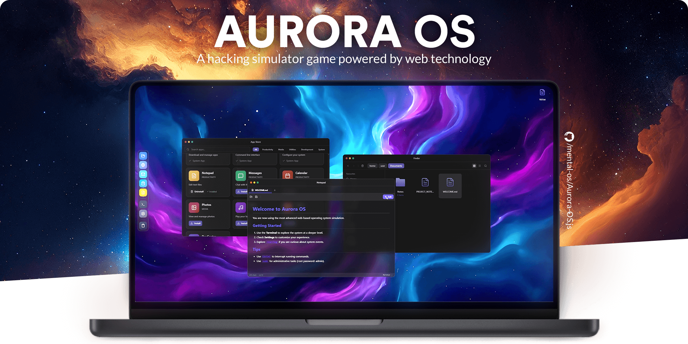

# EduOS — Interactive OS Simulator

[](https://github.com/TheVantaDev/OS_Simulator) 



An educational operating system simulator where learning OS concepts is the experience.

EduOS is an open-source, browser-based OS simulator built with modern web technologies: React, Vite, Tailwind, and Electron.
It provides a fully interactive virtual desktop environment designed to teach operating system concepts through hands-on practice — CPU scheduling, memory management, process synchronization, shell scripting, and more.

## ✨ What Exists Right Now

EduOS already delivers a complete, functional virtual OS environment:

- 🗂 **Virtual User Space**: Persistent `localStorage` filesystem with real user permissions (`rwx`), user homes, and multi-user isolation (`root`, `guest`, custom users).
- 🧠 **App Engine**: Window management, z-indexing, process lifecycle, and a global context-aware Menu Bar.
- 💻 **Terminal**: Bash-like environment with pipes, IO redirection, history, and internal commands (`ls`, `cat`, `grep`, `sudo`, `su`).
- 📦 **System Apps**:
  - **Finder**: Drag & drop file management, list/grid views, and trash can.
  - **App Store**: Install/uninstall apps with permission checks (`sudo` support).
  - **Settings**: System configuration, user management, and personalization.
  - **DevCenter**: System diagnostics and logs.
- 🎓 **Educational Apps**:
  - **CPU Scheduler**: Visual CPU scheduling algorithm simulator (FCFS, SJF, Round Robin, Priority).
  - **OS Learning Hub**: Interactive learning modules with embedded practice terminal covering Shell, CPU, Memory, and Process Synchronization.
- 🎨 **Creative & Media**:
  - **Photos**: Full gallery with albums, favorites, lightbox, and reactive library scanning.
  - **Music**: Playlist management, background playback, and binary ID3 metadata parsing.
- 📝 **Productivity & Internet**:
  - **Notepad**: Monaco-like editor with syntax highlighting for 10+ languages.
  - **Browser**: Functional web browser simulation with history and tabs.
  - **Mail**: Email client simulation with attachments and multiple mailboxes.
  - **Calendar**: Event management with drag & drop support.
  - **Messages**: Chat interface simulation.
- 🌍 **Localization**: Fully translated in English, German, Spanish, French, Portuguese, Romanian, Chinese, Russian, Japanese, Polish, Korean, and Turkish.

## 🔬 Educational Terminal Commands

EduOS includes 6 specialized simulation commands built into the terminal:

| Command | Description |
|---------|-------------|
| `ps-sim` | Process simulator — create, list, and manage virtual processes |
| `schedule` | CPU scheduling algorithm visualizer (FCFS, SJF, RR, Priority) |
| `mem-sim` | Memory allocation simulator (First Fit, Best Fit, Worst Fit) |
| `page-fault` | Page replacement algorithm simulator (FIFO, LRU, Optimal) |
| `deadlock` | Deadlock detection and visualization |
| `banker` | Banker's Algorithm for deadlock avoidance |

## 🧭 Where This Is Going

EduOS is developed with a clear educational mission:

- **Stage 0 (Current) — Foundation & Usability**: Functional desktop OS with real applications and natural usability.
- **Stage 1 — Interactive Curriculum**: Structured learning paths, quizzes, and assessment tools.
- **Stage 2 — Classroom Integration**: Multi-student environments, progress tracking, and instructor dashboards.

### [View full roadmap](ROADMAP.md)

## 🧠 Why This Exists

Operating system concepts are traditionally taught through dry lectures and disconnected lab exercises. EduOS bridges that gap by providing an interactive environment where students can:

- **See** scheduling algorithms execute in real-time
- **Practice** terminal commands in a safe sandbox
- **Explore** memory management strategies hands-on
- **Understand** process synchronization through interactive simulations

Inspired by projects like [OS.js](https://github.com/os-js/OS.js) and [Puter](https://github.com/HeyPuter/puter), EduOS reshapes a virtual OS into an educational platform.

## 🧪 Current Status

- Actively developed
- Architecture stabilizing
- Educational modules expanding
- Looking for **contributors, educators, and curious minds**

This is the ideal phase to influence direction, content, and learning design.

## 🤝 Contributing & Contribution Terms

EduOS is open-source and community-friendly.

Contributions of all kinds are welcome — code, design, documentation, educational content, and feedback.
To keep things transparent and fair for everyone, contributions are made under clear contribution terms.

Before submitting a Pull Request, please read:

- **[CONTRIBUTING.md](CONTRIBUTING.md)** — how to contribute, expectations, and contribution terms
- **[CONTRIBUTORS.md](CONTRIBUTORS.md)** — permanent credit for everyone who helped shape the project

In short:

- You keep authorship of your work
- Your contribution is credited permanently
- Your contribution may be used in open-source and future versions of EduOS

If anything feels unclear, open a [discussion](https://github.com/TheVantaDev/OS_Simulator/discussions) — transparency matters here.

## Tech Stack

- **Framework**: React 19 (Vite 7)
- **Engine**: Electron 39 (Node 25) / ESNext
- **Language**: TypeScript 5
- **Styling**: Tailwind CSS v4
- **UI Library**: shadcn/ui (Radix UI, Sonner, Vaul, CMDK) + Custom Components
- **Icons**: Lucide React
- **Animation**: Motion (Framer Motion)
- **Audio**: Howler.js
- **Testing**: Vitest

## 🚀 Getting Started

> **Prerequisite**:
> Node.js 24.0.0+ is required.
> Chromium-based browsers (Chrome, Edge, Brave, etc.)

```bash
npm install
npm run dev
```

## 📝 License & Others

### Community

- [CONTRIBUTORS.md](CONTRIBUTORS.md)

### Other links

- [GitHub](https://github.com/TheVantaDev/OS_Simulator)

### License

- **Licensed as**: [AGPL-3.0](LICENSE)
- **Open-source code**: [OPEN-SOURCE.md](OPEN-SOURCE.md)
- **Contributing**: [CONTRIBUTING.md](CONTRIBUTING.md)

### AI Disclosure

This project uses AI tools for assistance in documentation, bug testing, and development. All core architecture and educational design is human-directed.
